# Integração de um robô digital

## Tecnologias utilizadas:
Nessa simulação de robô digital, usei uma engine de jogos digitais para simulação de conexão entre o robô e um servidor local em flask.
* Backend em Flask
* Banco de dados com Sqlite3
* Frontend com render_template do Flask em html, css
* Engine GODOT

## Inicialização da simulação:
Primeiro, é necessário ativar o ambiente virtual do python. Nesse caso, é só executar o seguinte comando no terminal dentro da raiz do projeto:

`flask-robot-m5>Scripts\activate`

Depois, abrimos o servidor local em flask:

`flask-robot-m5>python app.py`

Com isso, o servidor local será criado na seguinte rota:

*http://127.0.0.1:5000*

## Frontend
Acessando a rota, temos uma página simples em html sem css que possui três partes importantes:
* Atual posição do robô
* Adicionar posição
* Outras posições do robô
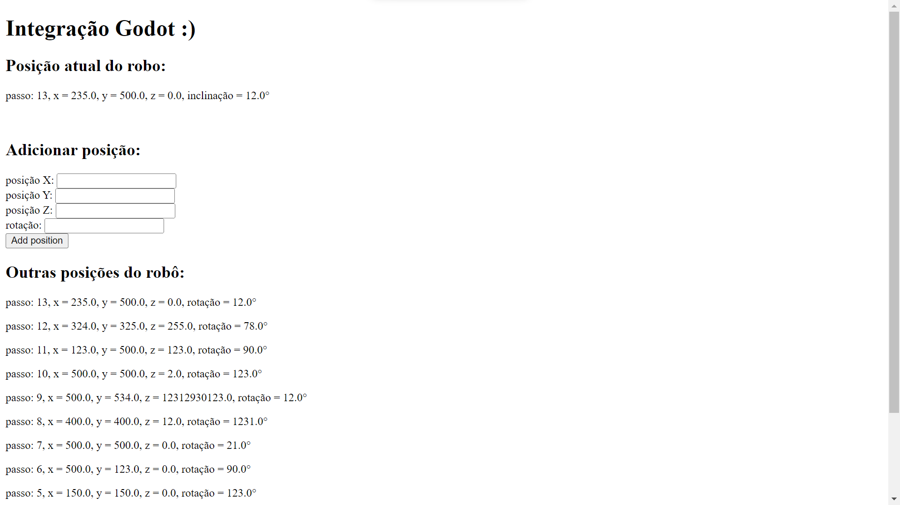

## Backend
No backend, há os imports e a criação da tabela *robot*, além da instância do servidor na variável *app*, que será usada para servir as rotas no servidor:

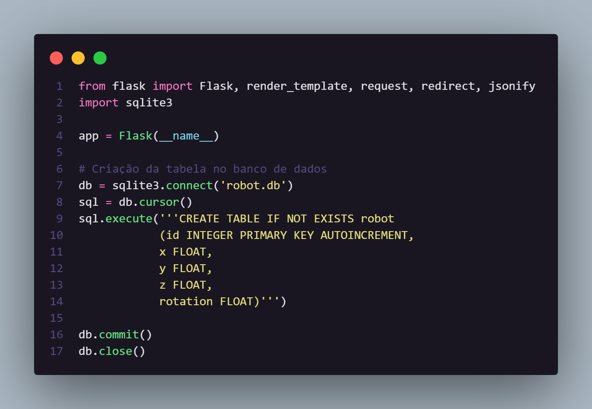

Em seguida, temos a definição da rota que servirá o frontend em html utilizando a função do flask `render_template`. Além disso, essa rota também acessa o banco de dados e envia todas as linhas do banco de dados em ordem decrescente de id como um array para o frontend:

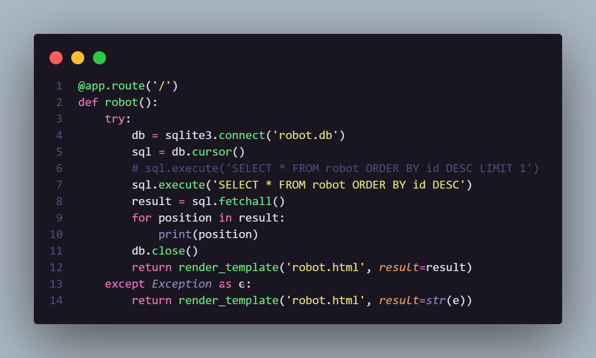

No frontend, essas linhas são percorridas para printar todas as posições:

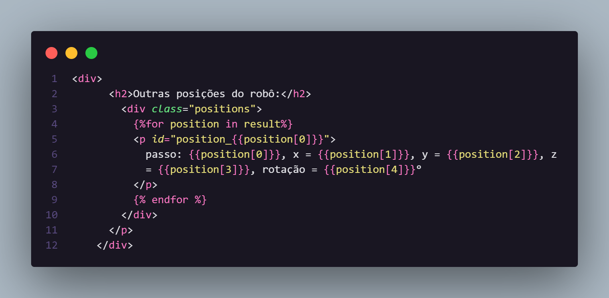

E, também, para pegar apenas a última posição que foi enviada à tabela (já que estamos em ordem decrescente, ela será a primeira do array sempre):

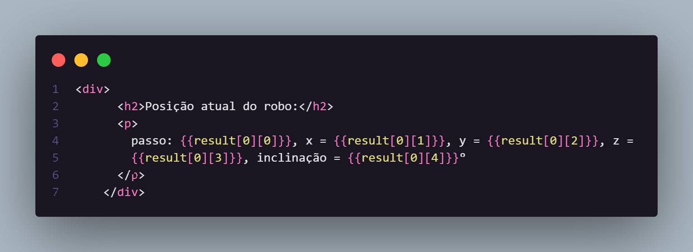

Além disso, há, também, uma rota de post de informações que se liga ao form do html, ela pega os dados do form pelo objeto `request` e armazena em variáveis que, após abrirmos uma conexão com o banco de dados, são inseridas na tabela `robot`. Por fim, redirecionamos para a rota principal:

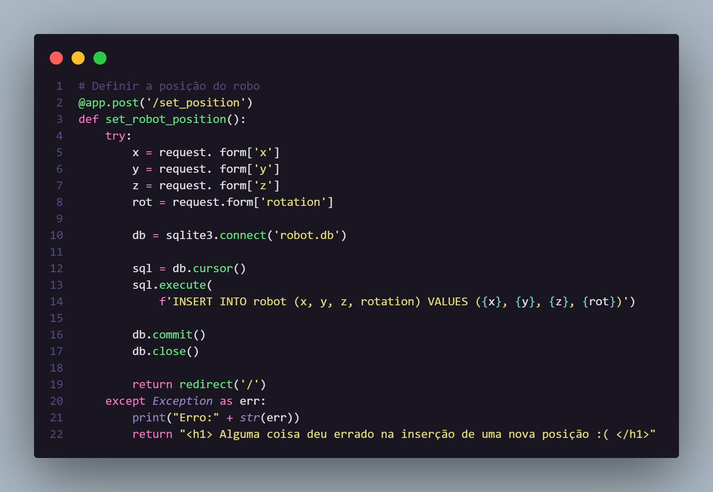

Depois, definimos duas rotas para get de informações:
* Na primeira, retornamos um json com apenas a última posição. Na simulação, essa rota será constantemente acessada a fim de sempre atualizar a posição do robô digital.
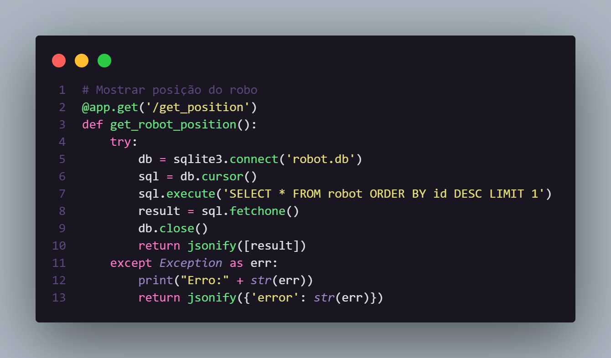

* Na segunda rota, retormamos um json com todas as linhas do banco de dados. Na simulação, essa rota será acessada apenas no início a fim do robô digital passar por todas as posições já registradas no banco de dados, como uma "dança" pelo campo:
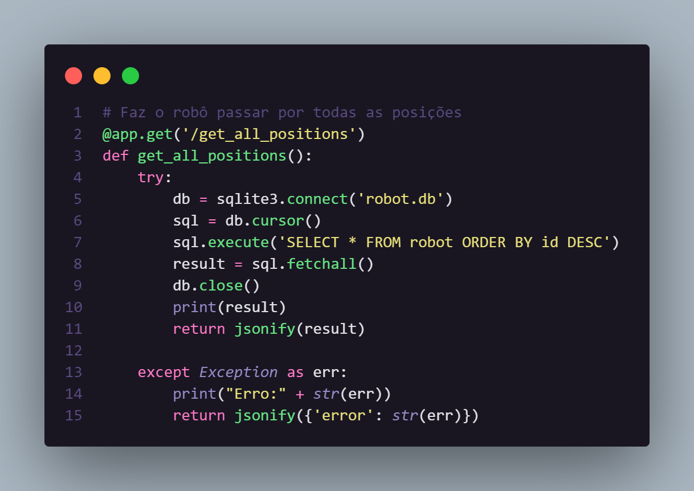

## Simulação

No GODOT, temos apenas o script do CanvasLayer na cena principal (e única). As primeiras linhas definem o objeto `http_request` e a função nativa `_ready()`, que basicamente é executada apenas uma vez na inicialização da simulação. Ela, por si, adiciona o objeto criado como um novo nó, conecta ele com a função `_http_request_completed()`, nativa do tipo de nó `HTTP_REQUEST`, e, por último, faz uma requisição para a rota get que retorna todas as posições do robo.
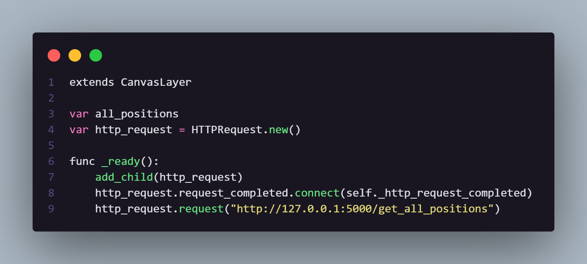

Depois, definimos a função `_http_request_completed`. Assim que uma requisição http é executada com sucesso, essa função é executada. Basciamente, ela traduz o json retornado pelos *gets* das rotas do backend e, para cada posição (mesmo que seja apenas uma), as propriedades posição, rotação e modulate (que altera as cores do nó) do Sprite2D que uso como robô digital são alteradas mediante os dados advindos.
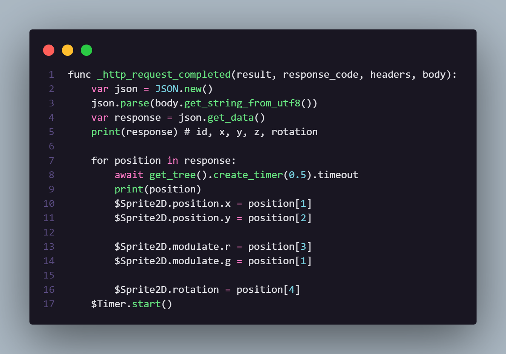

Por último, o nó `Timer` é acionado para fazer uma requisição http ao longo do tempo.
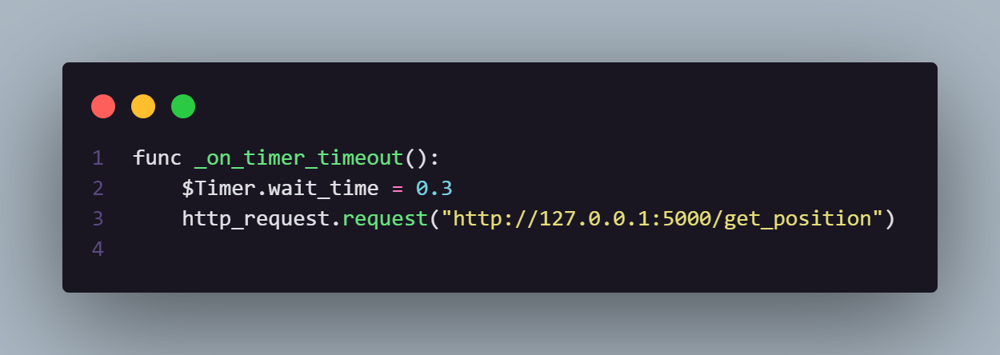